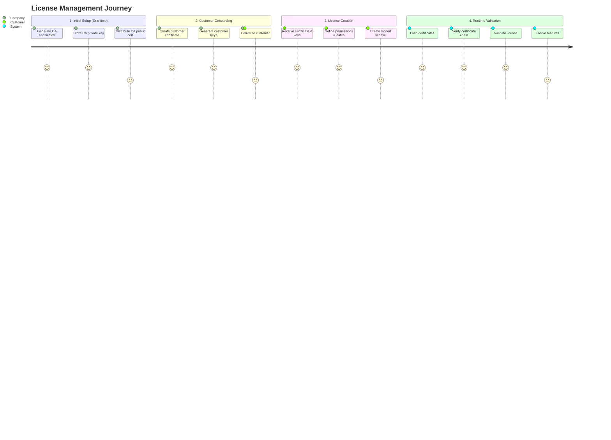
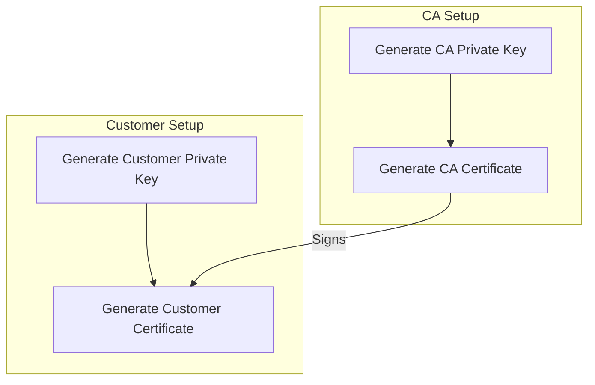
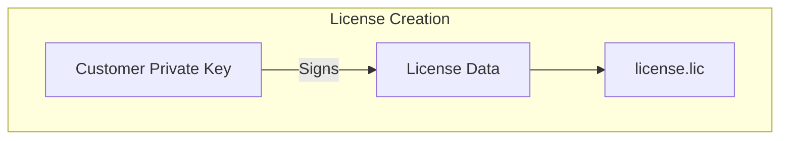
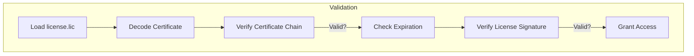

# Kaptifi Vision License Management - Detailed Guide

## Journey Overview



## Detailed Process Breakdown

### 1. Initial Setup (One-time Company Setup)

**Files Created:**
- `ca_private_key.pem`: 
  - 4096-bit RSA private key
  - Used to sign all customer certificates
  - MUST be kept secure and backed up
  - Never shared with anyone

- `ca_cert_public.pem`:
  - Public certificate containing CA's identity
  - Used to verify customer certificates
  - Embedded in the application
  - Valid for 10 years

**Technical Process:**
```bash
# Generate CA certificate
python license/ca_setup.py

# Verification
openssl x509 -in certificates/ca_cert_public.pem -text -noout
```

### 2. Customer Onboarding

**Files Generated:**
- `customer_public_cert.pem`:
  - Contains customer's identity
  - Signed by CA private key
  - Valid for 1 year
  - Includes:
    - Organization name
    - Country (SA)
    - License ID
    - Public key

- `customer_private_key.pem`:
  - 2048-bit RSA private key
  - Used to sign license files
  - Must be protected by customer
  - Never transmitted over network

**Technical Process:**
```python
customer_info = {
    "company": "Customer Company",
    "country": "SA",
    "organization_id": "611bac12-becd-45fa-b55d-e233650f4d54"
}
```

**Validation Checks:**
- Certificate chain verification
- Expiration date check
- Organization name validation
- Digital signature verification

### 3. License Creation

**License File Structure (`license.lic`):**
```json
{
    "certificate": "BASE64_ENCODED_CUSTOMER_CERT",
    "license": {
        "organization_id": "611bac12-becd-45fa-b55d-e233650f4d54",
        "modules": [
            "counting",
            "demographics"
        ],
        "issued_on": "2024-01-01",
        "expiration": "2025-12-31"
    },
    "signature": "DIGITAL_SIGNATURE_HEX"
}
```

**Technical Details:**
- Certificate encoding: Base64
- Signature algorithm: SHA-256 with PSS padding
- Key format: PKCS#8
- File format: JSON

**Generation Process:**
1. Load customer certificate
2. Create license data
3. Sign with customer's private key
4. Package all components
5. Save as license.lic

### 4. Runtime Validation

**Validation Steps:**
1. **Certificate Chain Verification:**
   - Load CA public certificate
   - Verify customer certificate signature
   - Check certificate dates
   - Validate customer details

2. **License Validation:**
   - Decode customer certificate
   - Verify license signature
   - Check expiration dates
   - Validate organization ID match
   - Confirm module permissions

3. **Security Checks:**
   - Certificate integrity
   - Signature authenticity
   - Time validity
   - Permission scope

**Error Handling:**
- Certificate expired
- Invalid signature
- Tampered license
- Missing modules
- Invalid organization ID

## Security Considerations

### Private Key Protection
- CA private key:
  - Stored offline
  - Access-controlled
  - Encrypted storage
  - Regular backup

### Customer Key Management
- Secure delivery process
- Installation verification
- Backup recommendations
- Update procedures

### License Security
- Tamper-evident design
- Digital signatures
- Time-based validation
- Module-level control

## File Locations
certificates/
├── ca_cert_public.pem # CA's public certificate
├── ca_private_key.pem # CA's private key (secured)
├── customer_public_cert.pem # Customer's certificate
├── customer_private_key.pem # Customer's private key
└── license.lic # Active license file


## API Integration

**Endpoints:**
- `GET /api/v1/license`: Check license status
- Response includes:
  - Validation status
  - Certificate details
  - Module permissions
  - Expiration dates

**Example Response:**
```json
{
    "valid": true,
    "message": "License valid",
    "organization_id": "611bac12-becd-45fa-b55d-e233650f4d54",
    "modules": ["counting", "demographics"],
    "issued_on": "2024-01-01",
    "expiration": "2025-12-31"
}
```

## Troubleshooting Guide

### Common Issues:
1. **Certificate Errors:**
   - Expired certificate
   - Invalid signature
   - Chain verification failed

2. **License Errors:**
   - Expired license
   - Invalid modules
   - Signature mismatch

3. **System Issues:**
   - File permissions
   - Missing certificates
   - Invalid file format

### Resolution Steps:
1. Verify file locations
2. Check file permissions
3. Validate dates
4. Confirm signatures
5. Review logs

## Maintenance Procedures

### Regular Tasks:
1. Certificate renewal
2. License updates
3. Security audits
4. Backup verification

### **Certificate & License Validation System Documentation**  
**Version 1.0**  

---

## **Overview**  
This system ensures secure authentication and authorization for software licenses using Public Key Infrastructure (PKI). It combines X.509 certificates and cryptographically signed licenses to prevent forgery and tampering.  

---

## **Key Components**  

### **1. Certificate Authority (CA)**  
- **Files**:  
  - `ca_private_key.pem` (Private Key): **Top secret**. Used to sign customer certificates.  
  - `ca_cert_public.pem` (Public Certificate): Distributed to validate certificates.  
- **Role**:  
  - Acts as the **root of trust**.  
  - Signs customer certificates to prove authenticity.  

### **2. Customer Certificate**  
- **Files**:  
  - `customer_private_key.pem` (Private Key): Held by the customer. Signs licenses.  
  - `customer_public_cert.pem` (Public Certificate): Embedded in licenses. Validated against the CA.  
- **Role**:  
  - Uniquely identifies a customer.  
  - Binds the customer’s `organization_id` to their public key.  

### **3. License File (`license.lic`)**  
- **Structure**:  
  ```json
  {
    "certificate": "<Base64-encoded customer certificate>",
    "license": {
      "organization_id": "...",
      "modules": ["..."],
      "expiration": "YYYY-MM-DD"
    },
    "signature": "<Hex-encoded signature>"
  }
  ```  
- **Role**:  
  - Grants access to specific software features.  
  - Tamper-proof due to cryptographic signing.  

---

## **Workflow**  

### **1. Certificate Generation**  

- **Steps**:  
  1. **CA Generates Root Certificate**:  
     - Creates a self-signed certificate (`ca_cert_public.pem`).  
  2. **Customer Certificate Issuance**:  
     - Customer generates a key pair.  
     - CA signs the customer’s certificate using `ca_private_key.pem`.  

---

### **2. License Generation**  

- **Steps**:  
  1. **License Data**: JSON containing `organization_id`, `modules`, and `expiration`.  
  2. **Signing**:  
     - Customer signs the license JSON with their private key (`customer_private_key.pem`).  
     - Signature is stored in `license.lic`.  

---

### **3. License Validation**  

- **Steps**:  
  1. **Certificate Chain Validation**:  
     - Verify `customer_public_cert.pem` is signed by the CA.  
     - Uses `ca_cert_public.pem` to validate the signature.  
  2. **License Validation**:  
     - Verify the license signature using the customer’s public key (from their certificate).  
     - Match `organization_id` in the license to the certificate.  

---

## **Security Model**  

### **1. Protection Against Forged Certificates**  
- **How**:  
  - Attackers can’t create valid certificates without the CA’s private key (`ca_private_key.pem`).  
  - Your system rejects certificates not signed by your CA.  

### **2. Protection Against Tampered Licenses**  
- **How**:  
  - Any change to `license` (e.g., extending expiration) invalidates the signature.  
  - Signature verification fails if data mismatches.  

### **3. Key Compromise Scenarios**  
| Scenario | Impact | Mitigation |  
|----------|--------|------------|  
| **CA Private Key Leaked** | Attackers can issue valid certificates. | Store offline, use HSMs, revoke CA. |  
| **Customer Private Key Leaked** | Attackers can forge licenses for that customer. | Reissue certificates, revoke old ones. |  

---

## **Enhancements (Optional)**  
1. **Sign Licenses with CA Key**:  
   - Makes licenses harder to forge (requires CA compromise).  
2. **Certificate Revocation**:  
   - Maintain a revocation list (CRL) for blocked certificates.  
3. **License Encryption**:  
   - Encrypt licenses with the customer’s public key for confidentiality.  

---

## **FAQ**  

### **Q: What if a hacker steals `license.lic`?**  
- **A**: They can’t modify it without invalidating the signature. The system will reject tampered licenses.  

### **Q: How do I revoke a customer’s access?**  
- **A**: Today: Shorten license expiration. Future: Implement a revocation list.  

### **Q: Why use customer keys to sign licenses?**  
- **A**: Delegates responsibility to customers to protect their keys. For stricter control, sign licenses with your CA key instead.  

---

**Appendix**: Example validation code and certificate generation scripts are in the repository’s `/certificates` directory.